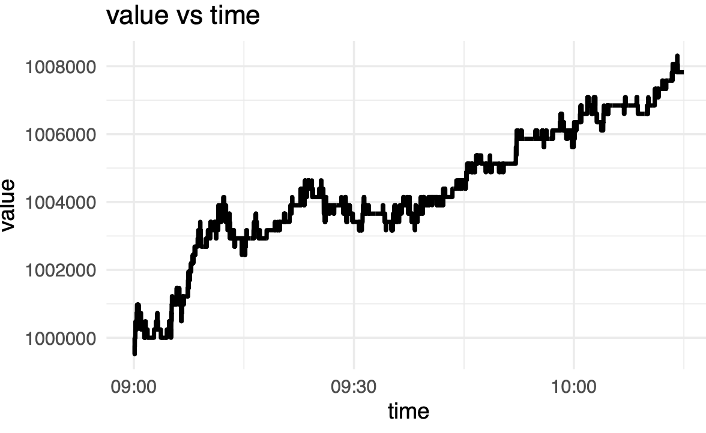

# High Frequency Trading Strategy Exercise

Welcome to our High Frequency Trading (HFT) strategy exercise repository. This project presents a comprehensive HFT model that leverages multiple factors to execute a strategy with positive returns. Our model processes market data at high speeds and makes trading decisions based on sophisticated algorithms.

## Project Overview

The focus of this exercise is to demonstrate the capability to develop and implement a high-frequency trading strategy that takes into account various market factors. The strategy is backtested to ensure positive returns in the given market condition

## Key Features

- **Multi-Factor Analysis**: Utilizes multiple factors for identifying trading opportunities in a high-frequency setup.
- **Strategy Implementation**: Detailed implementation of the trading strategy designed to exploit short-term market inefficiencies.
- **Backtesting Framework**: A robust backtesting engine that simulates the strategy against historical data to validate performance.
- **Positive Returns**: Demonstrated positive returns, adjusted for transaction costs and slippage.

